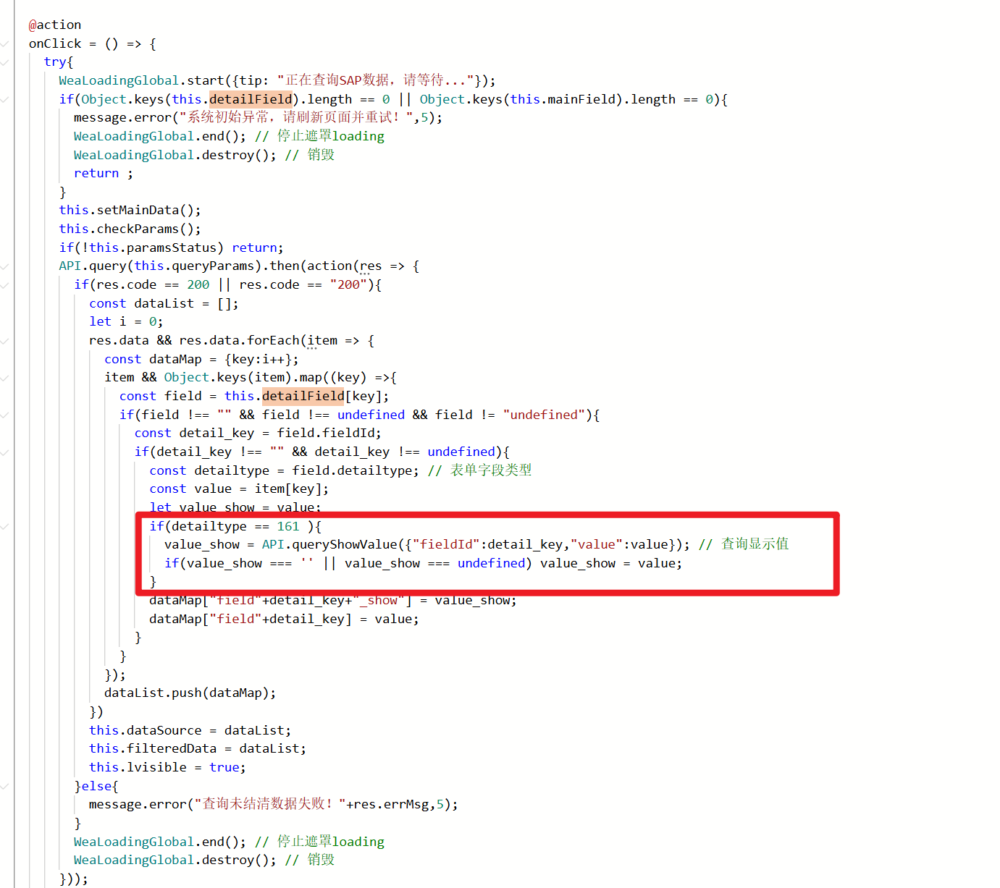
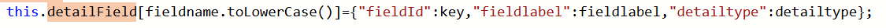
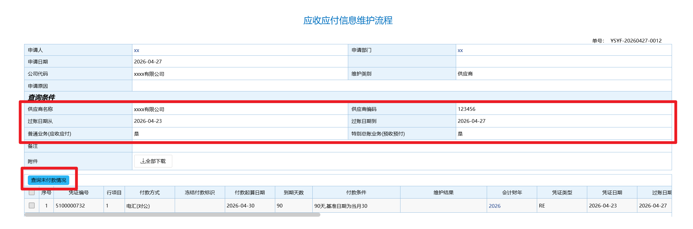
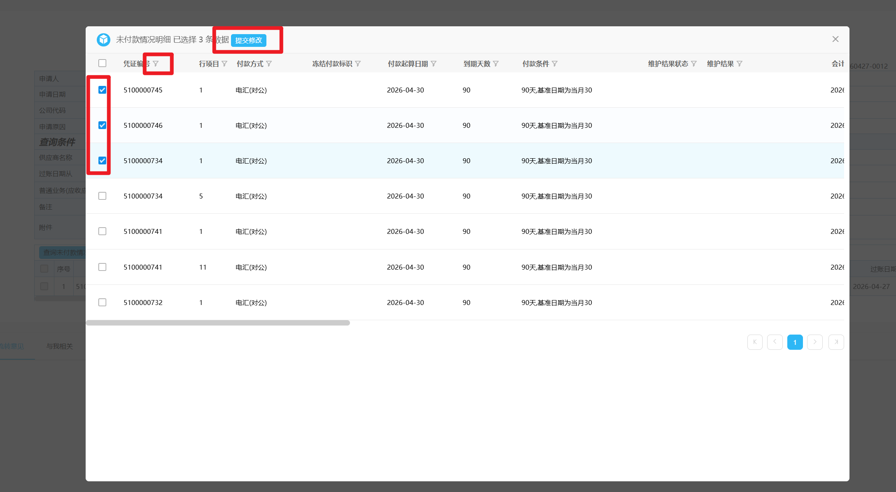

# EcologyInitTemp

## 流程表单新增按钮并点击触发列表弹框

### 案例场景说明
- OA查询SAP数据，然后弹窗给用户选择，将用户选择后的数据带入明细表

### 详细功能描述
- 用户填写主表字段作为条件入参，点击“查询未付款情况”按钮接口提取主表字段作为第三方查询入参条件
- 根据返回的第三方数据弹窗显示（案例中弹窗报表的列是和明细报一致的），选择后将数据写入明细表中

### 案例使用说明
- 在ecode中导入 “查询第三方系统数据作为弹窗选择.zip”
- 第三方接口在api/Api.js中query 方法是用于查询第三方数据的，queryShowValue 方法主要是用于将浏览按钮或下拉框之类的数据库值转换成显示值。

- queryShowValue方法： 
 ```
/**
 * 通过字段ID+实际值查询显示值
 * @param request
 * @param response
 * @return
 */
@POST
@Path("/queryShowName")
@Produces({MediaType.TEXT_PLAIN})
@Deprecated
public String queryShowName(@Context HttpServletRequest request, @Context HttpServletResponse response){
    try {
        Map<String,Object> params = ParamUtil.request2Map(request);
        int fieldId = Util.getIntValue(params.get("fieldId"),-1);
        String value = Util.null2String(params.get("value"));
        if("".equals(value) || fieldId == -1) return JSON.toJSONString(EcologyResult.success(""));
        String cacheKey = fieldId + "_" + value;
        if (Util_DataCache.containsKey(cacheKey)) return JSON.toJSONString(EcologyResult.success(Util.null2String(Util_DataCache.getObjVal(cacheKey))));
        BillField billField = new WorkflowBillFieldDao().selectById(fieldId);
        String showValue = Util.getSysShowName(billField,value);
        Util_DataCache.setObjVal(cacheKey,showValue,5 * 60);
        return JSON.toJSONString(EcologyResult.success(showValue));
    }catch (Exception e) {
        e.printStackTrace();
        return JSON.toJSONString(EcologyResult.error("通过字段ID+实际值查询显示值发生异常，请联系管理员！" ));
    }
}
 ```
- 核心的数据处理动作是在store/dataStore.js 文件中，如需调整显示的列信息可直接调整setColumns 方法，返回的列信息可参照组件库中Table组件的列要求。
- 第三方接口数据返回后回填明细表时，目前案例中第三方接口返回的字段名称和明细表字段名称是完全一致的，如果实际使用中存在不一致的情况，需要自行构建detailField对象，存储第三方接口字段名和明细表fieldId的关系。

- 

### 截图


