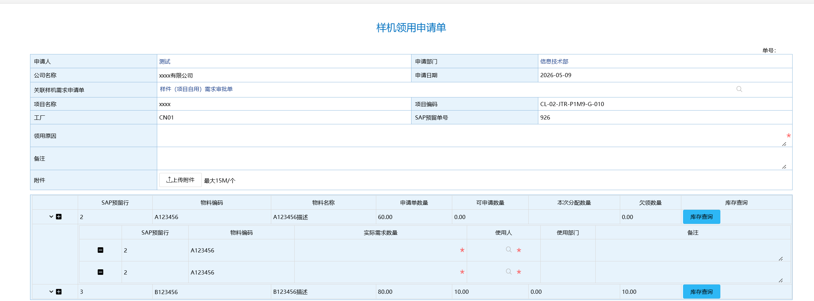
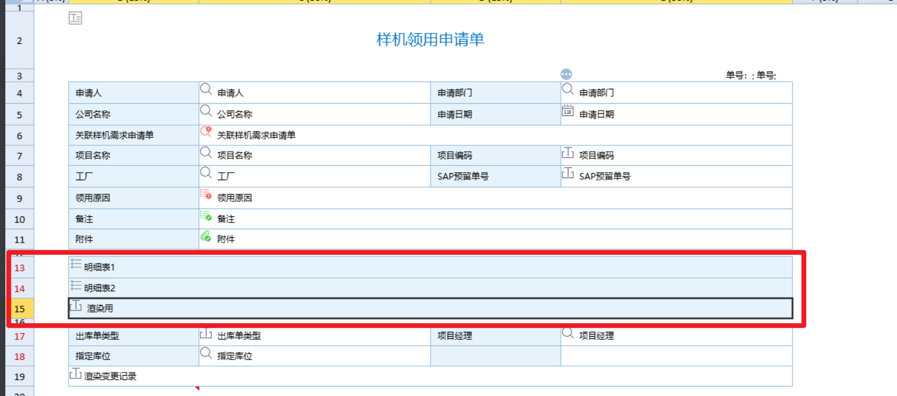

config配置项，通过表单id作为对象key。# 明细表嵌套明细表
## 功能描述
1. 两个存在一定数据关系的父子明细表，构建成父子接口可展开形式的列表。
2. 注：未配置移动端效果

## 配置说明
1. 在ecode中导入 “明细表嵌套明细表.zip”
2. 调整register.js文件中的config配置项，通过表单id作为对象key，fieldName表示用于渲染自结果显示位置的字段，
   mainDetail表示父明细表，detail 表示子明细表，mainCollectionField 表示父明细表中的唯一字段，collectionField字段存放父明细表中的唯一字段（mainCollectionField）通过这两个字段构建父子明细表的关联关系。addData中存放增加子明细表时需要从父明细表中带入的字段信息，key为父明细表字段名称，value为子明细表字段名称。
3. 配置文件示例
```
  "-1058" : {
    // 渲染的位置字段，建一个没用的字段放着就好了
    fieldName:'xry',
    // 主明细表
    mainDetail:'detail_1',
    // 主明细表的标识字段
    mainCollectionField:'mxid' ,

    // 副明细表
    detail:'detail_2',
    // 副明细表的关联字段。
    collectionField:'mxid',
    addData:{
      cltx_oa_rwn:"cltx_oa_rwn", // sap预留行号
      mtrl_code:"mtrl_code",
      wlmc:"wlmc",
      cltx_use_dept:"cltx_use_dept"
    }
  }
```

## 截图
  
