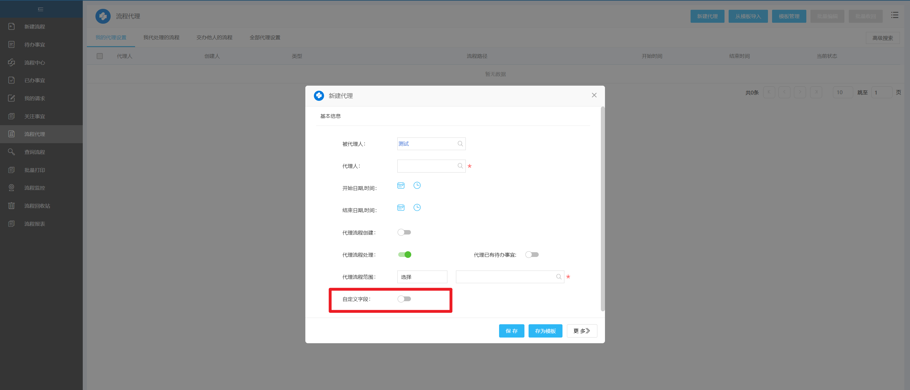
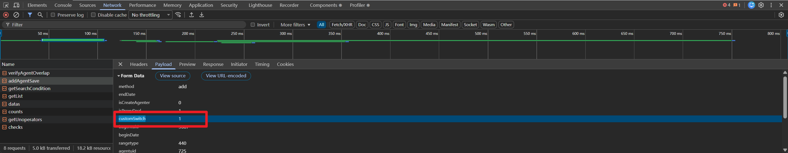

# 新建代理页面增加自定义字段

## 功能描述
- 新建代理页面增加自定义字段,保存时同步将自定义字段返回给后端
- 该案例主要是一个参考，对于其他类似的页面应该也可以通过该方法实现自定义字段的增加

## 配置说明
- 在ecode中导入 “新建代理页面增加自定义字段.zip”
- config/config.js中的label和fieldId为自定义需要的字段显示名称和数据库字段id
- 调整后端文件中的 getAddAgentInfo 方法中的domKey字段
- 后端代码通过接口拦截的方式增加自定义字段和获取保存的自定义字段值。请新建代码文件，放在 ** com.xxx.impl ** 目录下。
```
	@WeaIocReplaceComponent
	public class WorkflowAgentIntercept {
		BaseBean log = new BaseBean();

		public WorkflowAgentIntercept() {
		}

		@WeaReplaceAfter(
				value = "/api/workflow/agent/getAddAgentInfo",
				order = 1,
				description = "新建代理增加自定义字段"
		)
		public String getAddAgentInfo(WeaAfterReplaceParam weaAfterReplaceParam) {
			String data = weaAfterReplaceParam.getData();
			HttpServletRequest request = weaAfterReplaceParam.getRequest();
			String domKey = "customSwitch";
			JSONObject dataJson = JSON.parseObject(data);
			JSONObject fields = dataJson.getJSONObject("fields");
			fields.put(domKey,createSwitch(domKey));
			data = JSON.toJSONString(dataJson);
			return data;
		}

		private SearchConditionItem createSwitch(String domKey){

			ConditionFactory factory = new ConditionFactory(new User(1));
			return factory.createCondition(ConditionType.SWITCH, -1, domKey);
		}

		@WeaReplaceAfter(
				value = "/api/workflow/agent/addAgentSave",
				order = 1,
				description = "新建代理增加自定义字段-获取保存后的结果"
		)
		public String addAgentSave(WeaAfterReplaceParam weaAfterReplaceParam) {
			String data = weaAfterReplaceParam.getData();
			HttpServletRequest request = weaAfterReplaceParam.getRequest();
			Map<String,Object> params = InterceptUtil.getRequestParams(request); // 通过该方法获取请求参数，并且传递到具体的执行者中
			log.writeLog("addAgentSave->params："+JSON.toJSONString(params)); // 前端提交过来的参数
			log.writeLog("addAgentSave->data："+data); // 后端执行成功后返回的结果
			return data;
		}
	}
```
- 读取请求参数的方法，之前发现标准的方案好像会有问题，所以自定义构建了一个
```
public class InterceptUtil {
    public static Map<String, Object> getRequestParams(HttpServletRequest request) {
        HashMap map = new HashMap();
        Enumeration names = request.getParameterNames();

        while(names.hasMoreElements()) {
            String s = (String)names.nextElement();
            map.put(s, request.getParameter(s));
        }
        return map;
    }
}

```

## 截图



## 相关资料
- 接口拦截: https://e-cloudstore.com/doc.html?appId=3765707c36e146049241e55c10796af1
- 后端字段构建: https://cloudstore.e-cology.cn/#/pc/component/WeaForm/demo-0
