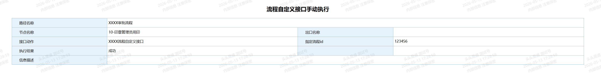

# 节点后自定义接口手动执行

## 功能描述
- 节点后附加操作指定接口动作允许手动执行，避免通过流程干预重新提交，同时避免流程干预后重新提交时所有接口都被执行了的情况。
- 目前个人只要测试了 自定义开发接口、建模流程转数据接口，对于其他类型的接口如考勤、文档生成等相关接口需自行测试下是否可用。
- 
## 配置说明
- 在“建模引擎-导入导出”导入“应用-流程自定义接口手动执行.zip”包
- 将“solelyr-ecology.1.0.1.jar”文件复制至服务器“安装目录\ecology\WEB-INF\lib”目录下，重启服务。
- 在“建模引擎-查询”菜单下搜索“流程自定义接口手动执行”查询列表，右键预览
- 在预览的查询列表页面点击新建，如无新建按钮则检查下对应模块的创建权限。
- 根据表单内容选择“路径名称、节点名称或出口名称、接口动作”，填写“指定流程id”，完成后点击保存，查看执行返回的结果。

## 截图
