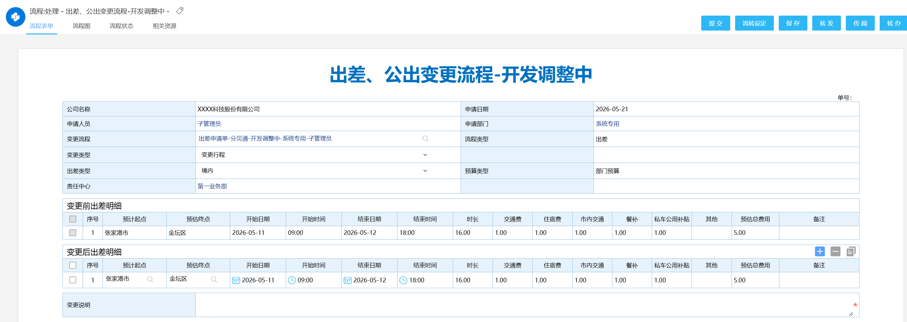

# 考勤流程-出差变更带出申请单自定义明细字段

## 功能描述
- 泛微标准配置的出差变更流程只能带出于考勤相关的字段，比如出差日期、时间等。无法带出自定义的字段比如出发地点，预估费用等自定义的字段，通过该该方案允许变更时带出并调整与考勤无关的自定义字段，满足不同公司对于出差管理的不同要求。
- 接口执行后与正常配置考勤流程效果一致

## 开发说明
- 在自定义接口中调用OA出差申请新建考勤数据接口，无需在考勤后台配置出差流程
- 流程表单中通过关联出差单申请+字段联动带出原出差单的明细信息。
- 通过表单上的关联出差申请在接口中对历史出差数据做失效处理
- 核心参数在于Map sqlMap = new HashMap(); key：表名###明细表名###1###workflowid，value：自定义的sql。
- 自定义sql的列名必须为【requestid,detailId,detail_departmentId,detail_duration,detail_fromDate,detail_fromTime,detail_resourceId,detail_toDate,detail_toTime,requestname,status,lastname,c_departmentId,departmentname,subcompanyid1,workcode】

## 配置说明
- 调整【(select t.requestid, t1.id as detailId,t.bm as detail_departmentId, t1.sc as detail_duration, t1.ksrq as detail_fromDate, t1.kssj as detail_fromTime, t.resourceId as detail_resourceId, t1.jsrq as detail_toDate, t1.jssj as detail_toTime from " + tableName + " t left join " + tableName + "_dt2 t1 on t.id = t1.mainid) t】该部分sql，根据自定义的流程表单上的字段进行调整。其余内容均不用调整。

## 截图
